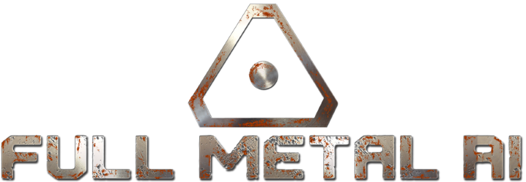

### Full Metal AI (Student Project)

Homepage: https://fullmetalai.itch.io

#### 3D (Survival)Twin Stick Shooter made in Godot 3.0.6 Engine

Full Metal AI is a fast paced 3D Twin-Stick-Shooter
in which the player has to overcome waves of hostile drones.

#### Gameplay
- fast & fluent Gameplay
- a powerful (but risky) overclocking mechanic for each weapon
- Game Modes for additional challenges and a richer gameplay experience
- Power ups for immediate tactical improvement

#### Roles
 - Gameplay and Tool Programmer
 
#### Engine / Languages 
- Godot, GDScript, C#

#### Responsiblities
- Implemented AI, Wave System , Weapon System , online scoreboard
- Implemente Threading to improve AI performance
- Integrated a system to add new game modes using csv files
- Created a tool for Game Designer to balance the game

https://youtu.be/6XhnEPoo0u4

[Build Download](/build/FullMetalAI.zip)

### Documentation and Build

I included some of the Documents i created.
  - [Technical Design Document](/docs/FullMetalAITDD.pdf)
  - [Inherited Scene Workflow](/docs/Workflow/InheritedScene.pdf)
  - [VFX Particle preparation Workflow](/docs/Workflow/VFXParticlePreparation.pdf)
  - [NavigationMesh](/docs/Workflow/NavigationMesh.pdf)
  
  
